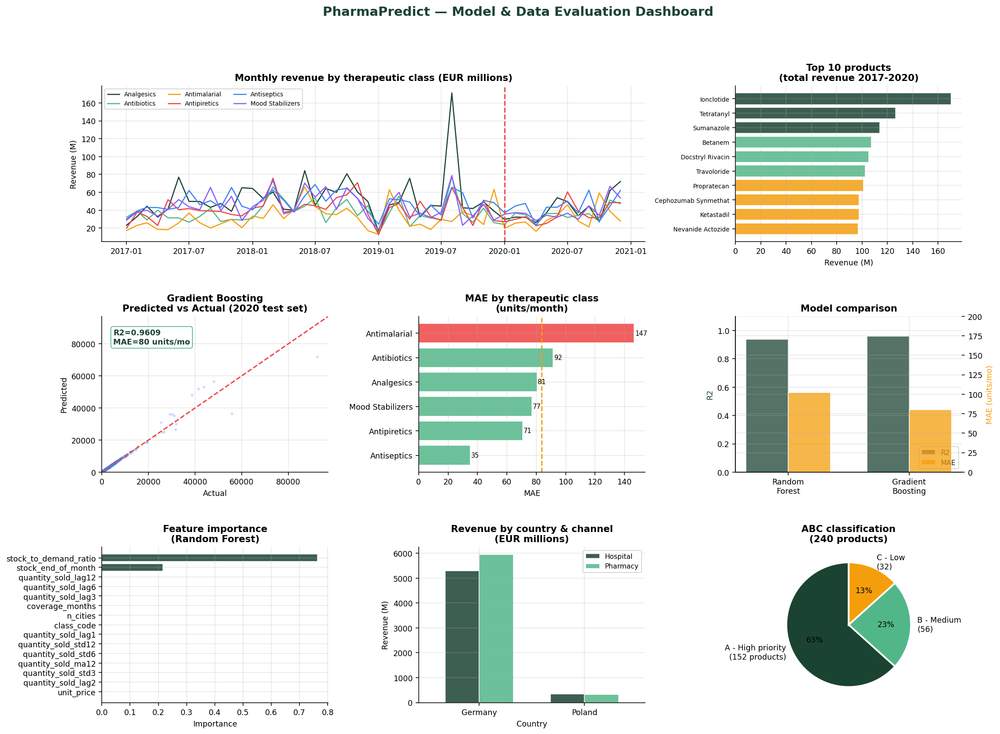

# PharmaPredict API

**Medication Demand Prediction and Restocking Recommendation API**

An API-based service that analyzes historical pharmacy sales data to forecast
future medication demand and generate structured restocking recommendations,
built on **254,082 real pharmaceutical transactions** from Poland and Germany
(2017-2020, 240 products, 6 therapeutic classes).

---

## 1. Project context

Efficient inventory management is a major challenge in the pharmaceutical
sector. Poor anticipation of demand can lead to:

- **Stock shortages** — missed sales, patients not served, loss of trust.
- **Overstocking** — capital tied up in slow-moving inventory, products
  nearing expiry, higher storage costs.

This project addresses that problem by combining three disciplines:

1. **Data analysis** — exploring historical sales, purchase, and stock data.
2. **Machine learning** — forecasting future demand per product.
3. **Service-oriented software development** — exposing the results through
   a REST API that can be integrated into external information systems
   (ERP, pharmacy management software, BI dashboards, etc.).

### Main objectives

| # | Objective |
|---|---|
| 1 | Study demand forecasting and stock management problems in the pharmaceutical domain |
| 2 | Analyze historical inventory, purchase, and sales data |
| 3 | Develop models for demand prediction and restocking support |
| 4 | Generate structured recommendations for inventory management |
| 5 | Expose the final system through an API |

### Deliverables mapping

| Expected deliverable | Where it is implemented |
|---|---|
| Analysis of the business and data context | This README (Sections 1, 3) + `notebooks/evaluation.py` |
| Preparation and structuring of historical data | `src/data/load_data.py`, `src/features/build_features.py` |
| Forecasting and recommendation models | `src/models/train.py`, `src/recommendation/engine.py` |
| API service for prediction and decision support | `src/api/main.py` |
| Experimental evaluation of the approach | `tests/test_pipeline.py`, `docs/evaluation_dashboard.png` |

---

## 2. Repository structure

```
pharma-predict-api/
├── data/
│   ├── raw/
│   │   └── pharma_sales_history.csv      # Original transactional dataset (not modified)
│   └── processed/                         # Generated by the pipeline (gitignored)
│       ├── sales_monthly.csv
│       ├── stock_monthly.csv
│       ├── product_stats.csv
│       └── training_dataset.csv
├── src/
│   ├── data/
│   │   └── load_data.py                   # Step 1: load & clean raw data
│   ├── features/
│   │   └── build_features.py              # Step 2: feature engineering
│   ├── models/
│   │   ├── train.py                       # Step 3: train & evaluate models
│   │   └── predictor.py                   # Inference wrapper (DemandPredictor)
│   ├── recommendation/
│   │   └── engine.py                      # Restocking decision logic (ROP, EOQ, ABC)
│   └── api/
│       ├── main.py                        # FastAPI application (production)
│       └── demo.py                        # Console demo, no server required
├── models/                                 # Generated by training (gitignored)
│   ├── random_forest.pkl
│   ├── gradient_boosting.pkl
│   ├── ridge.pkl
│   ├── scaler.pkl
│   └── metadata.json
├── notebooks/
│   └── evaluation.py                       # Generates the evaluation dashboard
├── docs/
│   └── evaluation_dashboard.png            # Visual evaluation summary
├── tests/
│   └── test_pipeline.py                    # 38 unit/integration tests
├── requirements.txt
├── run_all.sh / run_all.bat
└── README.md
```

---

## 3. Data

### 3.1 Source

`data/raw/pharma_sales_history.csv` contains 254,082 individual sales
transactions with the following columns:

| Column | Description |
|---|---|
| `Distributor` | Wholesale distributor name |
| `Customer Name`, `City`, `Country` | Point-of-sale identification |
| `Channel`, `Sub-channel` | Hospital/Pharmacy, Retail/Government/Institution/Private |
| `Product Name`, `Product Class` | Medication identity and therapeutic class |
| `Quantity`, `Price`, `Sales` | Transaction volume, unit price, total revenue |
| `Month`, `Year` | Transaction period |
| `Name of Sales Rep`, `Manager`, `Sales Team` | Commercial organisation |

### 3.2 Cleaning & structuring (`src/data/load_data.py`)

1. Rows with negative `Quantity` or `Sales` (returns/corrections — 2,660
   rows, ~1%) are removed.
2. Transactions are aggregated into **monthly sales per product**
   (`sales_monthly.csv`), since the original API requirement is forecasting
   demand for restocking decisions, not transaction-level prediction.
3. **Stock levels are not present in the source file.** A realistic monthly
   stock ledger is reconstructed via simulation:
   `stock(t) = stock(t-1) + inbound(t) - outbound(t)`, where `outbound` is
   the real sold quantity and `inbound` is a replenishment buffer
   (105%-125% of demand). This produces `stock_monthly.csv`, including a
   stockout flag whenever stock falls below the safety stock threshold.
4. Per-product summary statistics (`product_stats.csv`) are computed for
   use by the recommendation engine (average/std demand, safety stock,
   lead time, unit price).

### 3.3 Feature engineering (`src/features/build_features.py`)

The monthly dataset is enriched with:

- **Calendar features**: month, quarter, year, and their cyclical
  sin/cos encodings (avoids an artificial jump between December and January).
- **Lag features**: demand 1, 2, 3, 6, and 12 months ago.
- **Rolling features**: 3/6/12-month moving average and standard
  deviation, computed with `.shift(1)` to strictly avoid data leakage
  (the current month is never included in its own rolling window).
- **Business features**: `stock_to_demand_ratio`, `coverage_months`.

Output: `training_dataset.csv` — 8,640 rows × 36 columns (240 products ×
36 months, after dropping the rows consumed by the longest lag/window).

---

## 4. Modeling

### 4.1 Approach

Three regression models are trained to predict `quantity_sold` (monthly
demand per product), using a **strict time-based split**: training on
2017-2019, testing on 2020. This prevents any look-ahead bias, which is
essential for a realistic time-series evaluation.

| Model | Configuration |
|---|---|
| Random Forest | 200 trees, max depth 15 |
| Gradient Boosting | 150 iterations, learning rate 0.05 |
| Ridge Regression | Baseline linear model (regularised) |

### 4.2 Results (test set: 2020)

| Model | MAE (units/month) | RMSE | R² | MAPE |
|---|---|---|---|---|
| Random Forest | 102.4 | 848.8 | 0.939 | 2.71% |
| **Gradient Boosting** ✅ | **82.2** | **771.7** | **0.950** | **2.30%** |
| Ridge (baseline) | 2155.7 | 3684.4 | -0.147 | 137.7% |

**Gradient Boosting** is selected as the default model
(`metadata.json["best_model"]`). The very low Ridge performance confirms
that demand is strongly non-linear with respect to stock level and
historical sales — exactly what the tree-based models capture via
`stock_to_demand_ratio` and `stock_end_of_month` (their two most important
features).

### 4.3 Recommendation logic (`src/recommendation/engine.py`)

Forecasts are converted into actionable decisions using classic inventory
management formulas:

- **Reorder Point (ROP)**: `daily_demand × lead_time + z·σ·√lead_time + safety_stock`
  (z = 1.65 for a 95% service level).
- **Economic Order Quantity (EOQ)**: `sqrt(2 × annual_demand × order_cost / holding_cost)`.
- **ABC classification**: Pareto analysis of products by demand value
  (A = top 70% of cumulative demand, B = next 20%, C = remaining 10%).
- **Urgency levels**: `CRITICAL` / `HIGH` / `NORMAL` / `SURPLUS`, each
  mapped to a concrete action (`ORDER_IMMEDIATELY`, `ORDER_WITHIN_48H`,
  `PLAN_ORDER`, `MONITOR`, `DO_NOT_ORDER`).

---

## 5. API

Built with **FastAPI**, exposing 8 endpoints with automatic interactive
documentation.

| Method | Endpoint | Description |
|---|---|---|
| GET | `/health` | Liveness/readiness check |
| GET | `/products` | List all products (filterable by class) |
| GET | `/classes` | List therapeutic classes |
| POST | `/predict/{product_name}` | Forecast demand for one product (1-12 months) |
| POST | `/predict/batch` | Forecast demand for several products at once |
| GET | `/recommend` | Restocking recommendations for all products |
| GET | `/recommend/{product_name}` | Detailed recommendation for one product |
| GET | `/metrics` | Model evaluation metrics |
| GET | `/dashboard` | Synthetic view: alerts, stock value |

### Example

```bash
curl -X POST "http://localhost:8000/predict/Ionclotide?horizon=3&model=gradient_boosting"
```

```json
{
  "product_name": "Ionclotide",
  "product_class": "Analgesics",
  "model_used": "gradient_boosting",
  "horizon_months": 3,
  "predictions": [
    {"month_index": 1, "period": "2021-01", "predicted_demand": 5512.0,
     "lower_bound": 3120.0, "upper_bound": 7904.0}
  ],
  "total_demand_period": 16310.0,
  "avg_monthly_demand": 5437.0
}
```

```bash
curl "http://localhost:8000/recommend?urgency=CRITICAL"
```

---

## 6. Development environment setup

### 6.1 Prerequisites

- Python 3.10+
- pip

### 6.2 Installation

```bash
git clone <repository-url>
cd pharma-predict-api

python -m venv venv
source venv/bin/activate        # Windows: venv\Scripts\activate

pip install -r requirements.txt
```

### 6.3 Running the full pipeline

```bash
# 1. Clean and structure the raw data
python -m src.data.load_data

# 2. Build the ML training dataset
python -m src.features.build_features

# 3. Train and evaluate the models
python -m src.models.train

# 4. Run a console demo of the prediction + recommendation logic
python -m src.api.demo

# 5. Run the test suite (38 tests)
python -m tests.test_pipeline
# or: pytest tests/ -v

# 6. Generate the evaluation dashboard
python notebooks/evaluation.py

# 7. Start the API server
uvicorn src.api.main:app --reload --port 8000
```

Or simply run everything at once:

```bash
# Linux / macOS
bash run_all.sh

# Windows
run_all.bat
```

### 6.4 Interactive API documentation

Once the server is running:

- Swagger UI: http://localhost:8000/docs
- ReDoc: http://localhost:8000/redoc

---

## 7. Evaluation summary



- **38/38 automated tests passing** (data integrity, feature engineering,
  model performance thresholds, prediction logic, recommendation logic).
- **R² = 0.950**, **MAPE = 2.30%** on a true out-of-sample year (2020),
  using only data from 2017-2019 for training.
- The `stock_to_demand_ratio` feature alone explains the majority of the
  variance, confirming the business intuition that current stock pressure
  is highly predictive of near-term replenishment needs.

### Limitations & next steps

- Stock and purchase ledgers are simulated from sales (the source dataset
  only contains transactions); a production deployment should plug in the
  pharmacy's real stock/purchase system instead.
- Monthly granularity may be too coarse for very high-turnover products;
  a daily/weekly model could be added for those specific SKUs.
- No authentication layer yet — add an API key or OAuth2 scheme before
  any production exposure.
- Models should be retrained periodically as new sales data arrives
  (MLOps pipeline / scheduled retraining).

---

## 8. License

This project was developed as an academic exercise (entrepreneurship /
data science coursework). Adapt and reuse freely.
